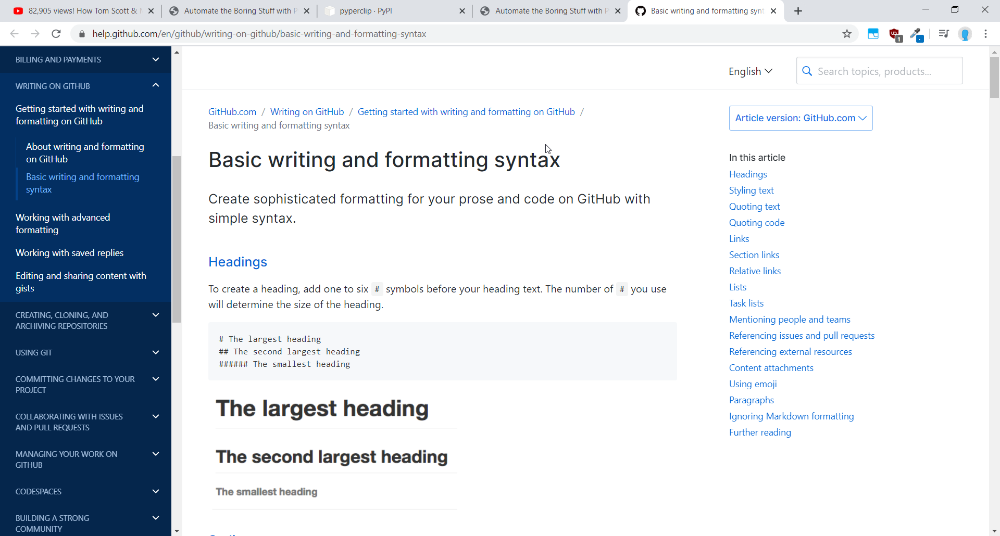

# Multi-link-opener

## This Python program opens all the links from your clipboard into separate tabs on a browser

---

## Usage

1. Copy links, separated by a unique separator such as a ",".
2. Execute the python program and provide a separator character for each link.
3. Incase no separator character is provided, the default separator is used which is a new line character.
4. All links open up in separate browser tabs.

---

## Used modules

1. [Webrowser](https://docs.python.org/2/library/webbrowser.html)
2. [Sys](https://docs.python.org/3/library/sys.html)
3. [Pyperclip](https://pypi.org/project/pyperclip/)

---

## Example

**Input:** `python openlinks.py ","`

The contents copied to the clipboard are as follows:

<https://www.youtube.com/watch?v=JjXBrJfp5TE> ,
<https://automatetheboringstuff.com/2e/chapter12/> ,
<https://pypi.org/project/pyperclip/> ,
<https://automatetheboringstuff.com/2e/chapter20/> ,
<https://help.github.com/en/github/writing-on-github/basic-writing-and-formatting-syntax>

**Output:**

---

## References

Idea obtained from [Automating the boring stuff with Python](https://automatetheboringstuff.com/2e/chapter12/) by AlSweigart
